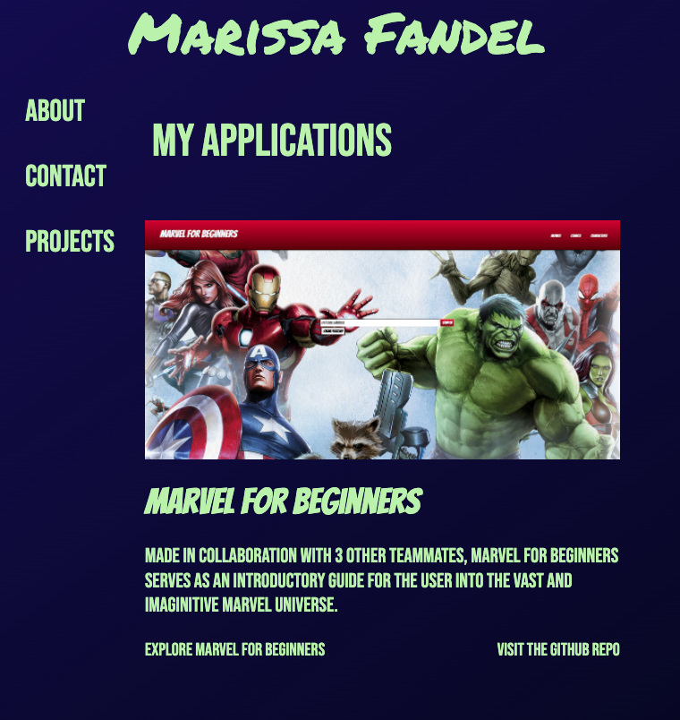

# Portfolio-Homework

## Description

This project was created to display my contact information & most recent applications to potential employers. The user can navigate through my Portfolio to receive more information about me & my projects.

## Features

- Nav bar that takes the user directly to what section of the portfolio they would like to see
- Links to see deployed applications as well as GitHub repos for my projects
- Links to my email, GitHub, LinkedIn
- Link to download my current Resume

## Link to Deployed Portfolio

https://mfandel118.github.io/Portfolio/

## Link to GitHub Repo

https://github.com/mfandel118/Portfolio

## Screenshots of Portfolio

